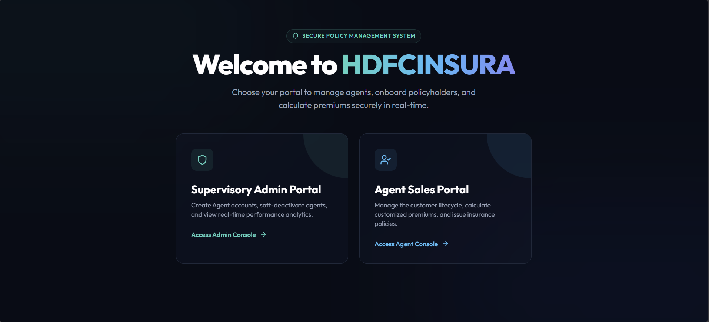
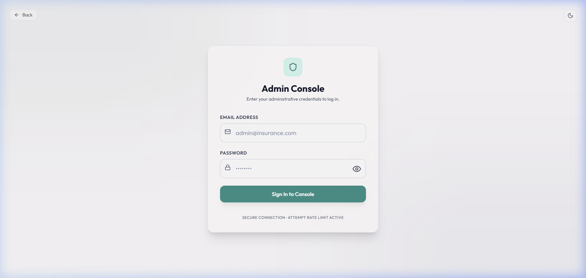
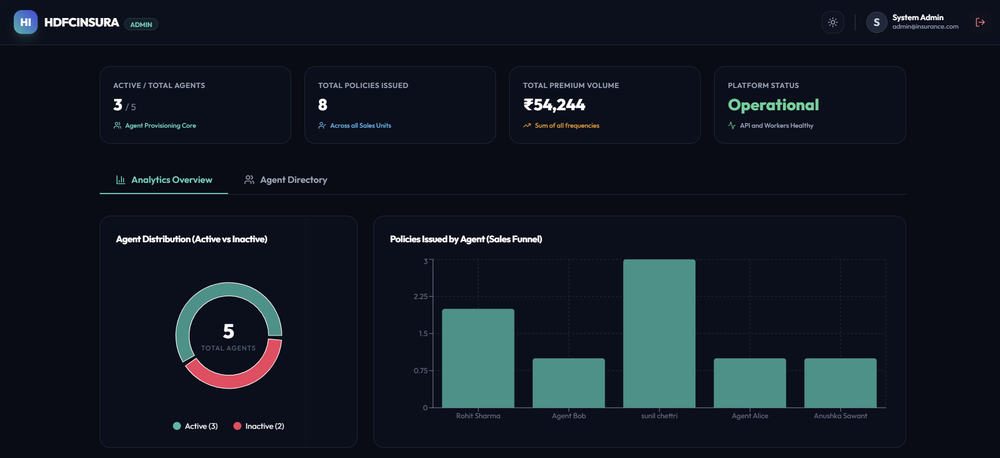
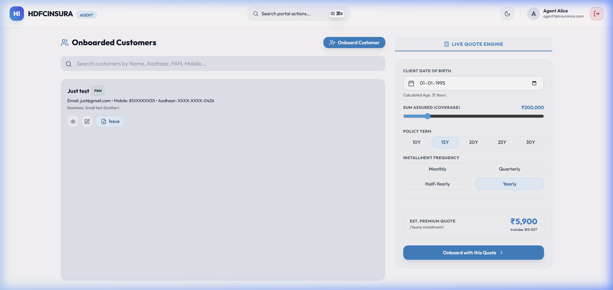

# HDFCINSURA — Insurance Policy Management System

A full-stack insurance policy management platform built on the MERN stack with TypeScript. It handles role-based access for Admins and Agents, enforces real-world insurance business rules, masks PII in every response, and keeps sessions alive through a sliding-window JWT refresh strategy.

**Live:** [hdfcinsura.vercel.app](https://hdfcinsura.vercel.app)  
**API:** [insureflow-backend-u92x.onrender.com](https://insureflow-backend-u92x.onrender.com)  
**Health check:** [/healthz](https://insureflow-backend-u92x.onrender.com/healthz)

> The backend is on Render's free tier — hit the health check URL first so it wakes up before you test anything.

---

## Screenshots

### Portal Selector


### Admin Login


### Admin Dashboard


### Agent Dashboard


---

## Demo Credentials

| Role    | Email                  | Password   |
|---------|------------------------|------------|
| Admin   | `admin@insurance.com`  | `admin123` |
| Agent 1 | `agent1@insurance.com` | `agent123` |
| Agent 2 | `agent2@insurance.com` | `agent123` |

---

## Tech Stack

| Layer            | Technology                                         |
|------------------|----------------------------------------------------|
| Backend          | Node.js · Express.js · TypeScript                  |
| Frontend         | Next.js 14 (App Router) · React 18 · TypeScript    |
| Database         | MongoDB (Mongoose ODM)                             |
| State Management | TanStack React Query v5                            |
| Auth             | Cookie-based JWT (HTTPOnly · Secure · SameSite)    |
| Validation       | Zod — shared schema between frontend and backend   |
| Forms            | React Hook Form + Zod resolver                     |
| Styling          | Tailwind CSS + Framer Motion                       |
| Testing          | Jest · Supertest · mongodb-memory-server           |
| API              | REST via Axios                                     |

---

## Project Structure

```
/
├── shared/            # Zod schemas + types shared between frontend and backend
│   └── src/index.ts
│
├── backend/
│   └── src/
│       ├── controllers/   # HTTP handlers
│       ├── services/      # Business logic + DB queries
│       ├── models/        # Mongoose schemas (User, Customer, Policy)
│       ├── routes/        # Route definitions + middleware binding
│       ├── middleware/    # Auth, ownership, error handling
│       ├── utils/         # PII masking helpers
│       ├── scripts/       # Seed script
│       └── tests/         # Jest test suites
│
├── frontend/
│   └── src/
│       ├── app/
│       │   ├── (auth)/       # Admin & Agent login pages
│       │   ├── (dashboard)/  # Admin & Agent dashboards
│       │   └── page.tsx      # Portal selector (landing)
│       ├── components/       # Auth provider, toast, theme, policy wizard
│       └── lib/              # Axios client config
│
├── package.json       # npm workspaces root
└── render.yaml        # Render deployment config
```

---


**Sliding-window session refresh** — If a valid request arrives within the last 5 minutes of a 15-minute session window, the backend transparently issues a new token in the response cookie. Active users never hit an unexpected logout.

**Cross-domain cookie handling** — Next.js `rewrites` in `next.config.js` proxy `/api/*` from the Vercel domain to Render, making cookies first-party. This sidesteps `SameSite=None` restrictions on Safari and Firefox without any security trade-offs.
